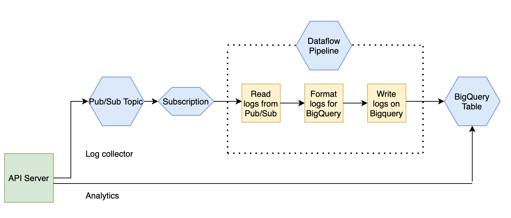

# log-collector

Server for log collection and analytics

### Data Pipeline Architecture

PubSub, Dataflow, and Bigquery datasets are created in GCP console. 

### Google credentials
    # Google will create json file for service account and it should be exported to run application.
    export GOOGLE_APPLICATION_CREDENTIALS={FILE_PATH}

### Scripts
    # create_bigquery_table
    It creates bigquery table by partitioning and clustering
    
    # import_dummy_events
    It fills bigquery table with dummy events

### Build

    # Clone
    git clone https://github.com/cakirmuha/log-collector.git
    cd log-collector/api

    export GO111MODULE=on

    # Compile
    go build

### Run
   
    Set up env vars:
    export PROJECT_ID={PROJECT_ID}
    export DATASET_ID={DATASET_ID}
    export TABLE_ID={TABLE_ID}
    export TOPIC={TOPIC}
    
    Then:
    ./api
 
 ### Example result for dummy data
    "data": {
      "total_user": {
        "count": 10
      },
      "daily_active_users": [
        {
          "day": "2020-08-23",
          "count": 10
        },
        {
          "day": "2020-08-24",
          "count": 10
        },
        {
          "day": "2020-08-25",
          "count": 10
        }
      ],
      "daily_average_durations": [
        {
          "day": "2020-08-23",
          "duration": 9586
        },
        {
          "day": "2020-08-24",
          "duration": 10861
        },
        {
          "day": "2020-08-25",
          "duration": 10451
        }
      ]
    }
